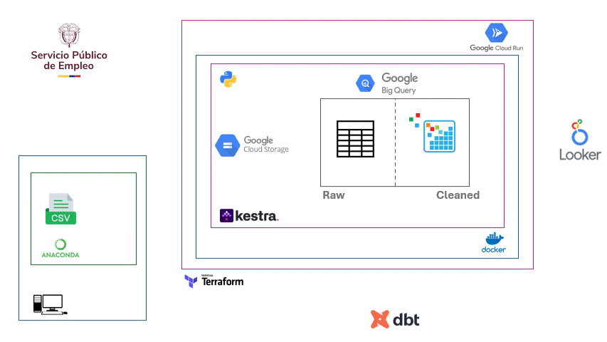
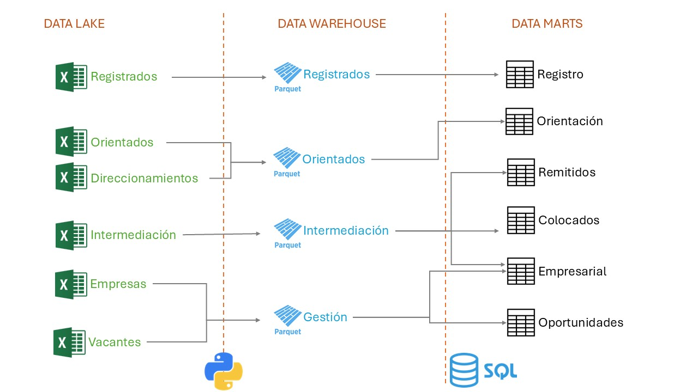

# Public Employment Pulse

*A Python powered data engineering initiative by the Employment and Inclusive Development Office of the Mayor’s Office of Barranquilla.*

Public Employment Pulse is a strategic data-driven project designed to provide insights into the structure and dynamics of the public employment center operations in the city of Barranquilla. It was built to empower decision-makers, this repository combines data engineering workflows with clear analytical rationale to enhance public sector efficiency and promote inclusive development.

### _What’s Inside:_

- Documentation of the public employment landscape challenges
- End-to-end data pipelines for transforming and integrating data
- Technical architecture and implementation details
- Visual dashboards for strategic monitoring

Photo: ©Ronald Candonga - pixabay.com

## Problem statement
This could be understood in two leves: a business problem and a technical problem. 

### _Business problem:_
Process control and decision-making dynamics within the Employment and Inclusive Development Office of the Mayor’s Office of Barranquilla have historically relied on data dispersed across multiple areas. As a result, tasks such as managing resources to serve both job-seeking citizens and employers in need of talent became a monumental challenge.

To address these issues, there is a pressing need for a solution that streamlines data processing, significantly reduces response times, and ensures the continuous availability of high-quality information. Such a system must also enhance the accuracy and timeliness of reporting—an especially critical requirement when attending to vulnerable or underserved populations.

For the manager of the city’s Public Employment Center, ensuring access to reliable, real-time insights is not only essential for operational efficiency but also a core responsibility in the delivery of inclusive and equitable services.

### _Technical problem:_

To address the fragmentation of data and improve decision-making within the Employment and Inclusive Development Office; as a data engineer, I must design and implement a centralized data integration and analytics platform.

The solution should automate the collection, cleansing, transformation, and storage of data from three key sources—citizen registration, psychological support services, and job placement records—into a unified data warehouse or lakehouse.

Next, the raw data must be processed and cleaned to ensure it is ready for use in visualization tools, enabling decision-makers to access insights at any time. All of this should be implemented within a cloud-based solution that enhances the reliability, clarity, and security of the data.

## Solution proposed
The proposed engineering solution extracts data from cumulative Excel registry files related to job seekers, recruitment interview preparation, companies, and job postings. These files are updated daily by staff and stored in the organization’s central repository on SharePoint, hosted in the Azure cloud. Once the relevant records for each month are identified, the data is converted and stored in `.parquet` format within a Google Cloud Storage (GCS) data lake, organized by month. The .parquet format is chosen for its efficient compression and fast query performance, while GCS offers scalable, secure, and cost-effective storage for large volumes of structured data.

Once all raw data is collected for job seekers, interview preparation activities, talent demand, and job posting intermediation targets, a dedicated pipeline for each data source is implemented using `Kestra` as the orchestrator. These pipelines clean the data and load it into individual tables in `BigQuery` (BQ), partitioned by the date of transfer.

The cleaned data in BigQuery will be transformed using `dbt` to generate final, optimized tables and data marts for each data sink. These curated datasets will then be sent to `Looker`, where interactive dashboards will be built to enable C-suite managers to make informed, data-driven decisions.

All these data operations are executed using `Python` within a `Dockerized` application image, ensuring portability and consistency across environments. The required infrastructure is provisioned and managed using `Terraform`, enabling version-controlled, automated deployments.

See here below the technologic architecture utilized:

Photo: Diagram of the solution engineered.

### Technologies used: 

For this project I used the following technologies:

- **Cloud:** Google Cloud Platform with the following components
    - *Deployment:* Google Cloud Run as a platform to deploy docker images.
    - *Datalake:* Google Cloud Storage.
    - *Data warehouse:* BigQuery.
    - *Data Visualization:* Looker studio.
- **Infrastructure as code (IaC):** Terraform.
- **Orchestration tool:** Kestra.
- **Data transformation:** Data Build Tool (dbt).
- **Containerizing:** Docker for developing, shipping, and running applications in containers. 

See here below a high level sketch of the data handling operations used:

Photo: Zoom of data handling operations inside GCP.

### Tutorial to reproduce the project:

The tutorials on how to setup and run this project can be found [here](https://github.com/bizzaccelerator/public-employment-pulse/wiki/Welcome-to-the-wiki).

