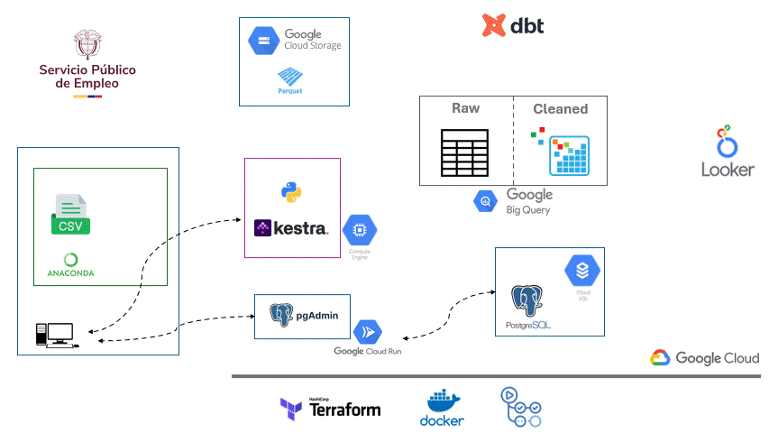
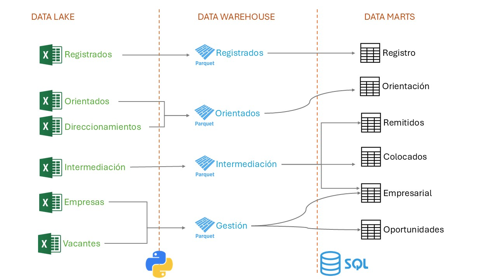

# Public Employment Pulse

*A Python powered data engineering initiative by the Employment and Inclusive Development Office of the Mayor’s Office of Barranquilla.*

Public Employment Pulse is a strategic data-driven project designed to provide insights into the structure and dynamics of the public employment center operations' in the city of Barranquilla. It was built to empower decision-makers, this repository combines data engineering workflows with clear analytical rationale to enhance public sector efficiency and promote inclusive development.

### _What’s Inside:_

- Documentation of the public employment landscape challenges
- Technical architecture and implementation details
- End-to-end data pipelines for transforming and integrating data
- Visual dashboards for strategic monitoring

Photo: ©Ronald Candonga - pixabay.com

## Problem statement
This could be understood in two leves: a business problem and a technical problem. 

### _Business problem:_
Process control and decision-making dynamics within the Employment and Inclusive Development Office of the Mayor’s Office of Barranquilla have historically relied on data dispersed across multiple areas. As a result, tasks such as managing resources to serve both job-seeking citizens and employers in need of talent became a monumental challenge.

To address these issues, there is a pressing need for a solution that streamlines data processing, significantly reduces response times, and ensures the continuous availability of high-quality information. Such a system must also enhance the accuracy and timeliness of reporting—an especially critical requirement when attending to vulnerable or underserved populations.

For the manager of the city’s Public Employment Center, ensuring access to reliable, real-time insights is not only essential for operational efficiency but also a core responsibility in the delivery of inclusive and equitable services.

### _Technical problem:_

To address the fragmentation of data and improve decision-making within the Employment and Inclusive Development Office; as a data engineer, I must design and implement a centralized data integration and analytics platform.

The solution should automate the collection, cleansing, transformation, and storage of data from three key sources—citizen registration, psychological support services, and job placement records—into a unified data warehouse or lakehouse.

Next, the raw data must be processed and cleaned to ensure it is ready for use in visualization tools, enabling decision-makers to access insights at any time. All of this should be implemented within a cloud-based solution that enhances the reliability, clarity, and security of the data.

## Solution proposed
The proposed engineering solution extracts data from cumulative Excel registry files related to job seekers, recruitment interview preparation, companies, and job postings. These files are updated daily by staff and stored in the organization’s central repository on SharePoint, hosted in the Azure cloud. Once the relevant records for each month are identified, the data is converted and stored in `.parquet` format within a Google Cloud Storage (GCS) data lake, organized by month. The .parquet format is chosen for its efficient compression and fast query performance, while GCS offers scalable, secure, and cost-effective storage for large volumes of structured data.

Once all raw data is collected for job seekers, interview preparation activities, talent demand, and job posting intermediation targets, a dedicated pipeline for each data source is implemented using `Kestra` as the orchestrator. These pipelines clean the data and load it into individual tables in `BigQuery` (BQ), partitioned by the date of transfer. 

A comprenhensive alert system is implemented to get notifications as `e-mail` messages when workflows finishes.

The cleaned data in BigQuery will be transformed using `dbt` to generate final, optimized tables and data marts for each data sink. These curated datasets will then be sent to `Looker`, where interactive dashboards will be built to enable C-suite managers to make informed, data-driven decisions. 

All these data operations are executed using `Python` within a `Dockerized` application image, ensuring portability and consistency across environments. The required infrastructure is provisioned and managed using `Terraform`, enabling version-controlled, automated deployments.

### Technologies used: 

For this project I used the following technologies:

- **Cloud:** Google Cloud Platform with the following components
    - *Process:* Google Compute Engine as a platform to process services.
    - *Datalake:* Google Cloud Storage.
    - *Data warehouse:* BigQuery.
    - *Data Visualization:* Looker studio.
- **Infrastructure as code (IaC):** Terraform.
- **Orchestration tool:** Kestra.
- **Data transformation:** Data Build Tool (dbt).
- **Containerizing:** Docker for developing, shipping, and running applications in containers. 

See here below the technologic architecture utilized:

Photo: Diagram of the solution engineered.

Please also check a high level sketch of the data handling operations used:

Photo: Zoom of data handling operations inside GCP.

### Tutorial to reproduce the project:

The tutorials on how to setup and run this project can be found [here](https://github.com/bizzaccelerator/public-employment-pulse/wiki).

## Tangible result

**Public Employment Pulse** modernized the Public Employment Agency’s data ecosystem, turning fragmented operational records into a structured, automated, and analytics-ready platform that now drives evidence-based decision-making in the Mayor’s Office of Barranquilla. This project delivered a complete, operational data engineering pipeline that transformed raw, operational data from the Public Employment Center into structured, analytics-ready datasets and interactive dashboard.

### Before the Project

* ****Reporting processes**** required 3–5 days of manual effort per cycle, reducing operational time of the agency
* ****Metrics varied across teams****, leading to inconsistent KPI definitions and conflicting reports across areas
* ****Raw data lacked validation****, resulting in error rates above 15% and frequent rework
* ****Decision-making**** relied on static reports with limited insight, often compromised by manual data handling errors and delayed updates

### Transformation & Results After Implementation

* A **fully automated pipeline** now delivers curated datasets **monthly**, eliminating repetitive manual work and **reducing reporting cycle time by 90%**
* A centralized data warehouse enables **standardized KPI calculation across all units**, ensuring consistency and comparability over time
* Embedded validation rules reduced data errors by over 90%, **improving overall accuracy from 85% to 98%** and eliminating human error in reporting
* Decision-makers access **reliable dashboards from any device — mobile or desktop — via the web**, cutting **reporting time from days to minutes** and boosting adoption among 40+ staff members
* Established **a single source of truth for employment intermediation analytics**, enabling the Mayor’s Office to track employment programs with near accurate visibility, strengthening accountability and resource allocation

### Dashboard:

A dashboard was created to visually deliver information about main indicators used in the agency. The following image captures it:

Then, you will see different sections as this:

An in-live, interactive version of the dashboard can be found [here](https://lookerstudio.google.com/u/0/reporting/7f0b5c4b-eefd-44c5-88a8-467a20638ec2) 

### Recommendations

It seems to exist an apparent relationship between the weather in a day and the number of player transferences performed in that specific day. However, it is recommended that further investigations need to be done.  

## Further Improvements

There is scope for improvement in several areas of this project, such as:
